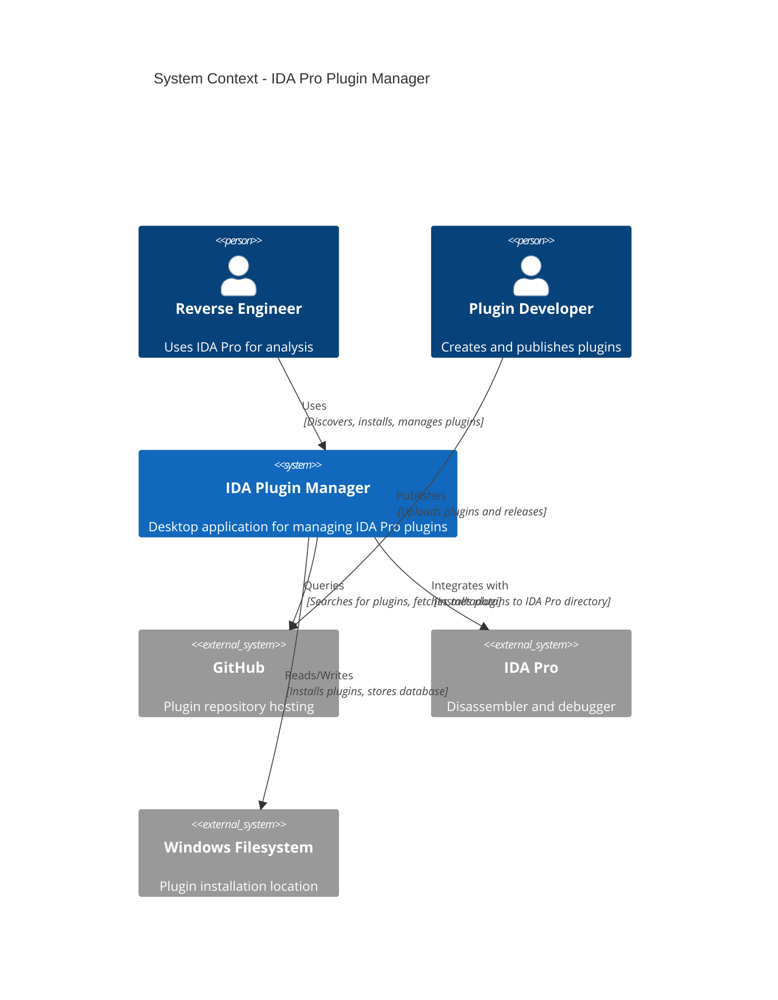
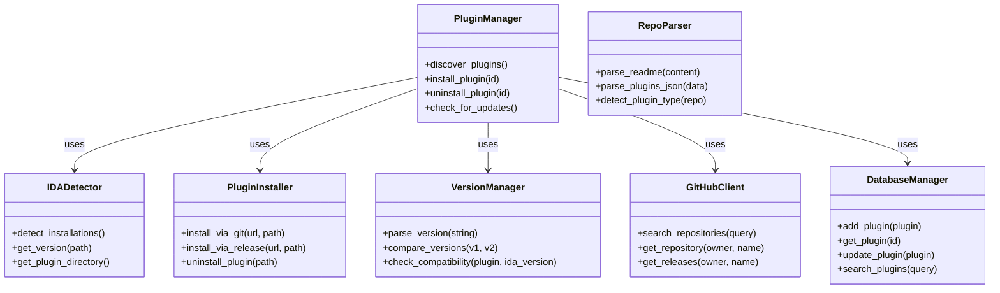
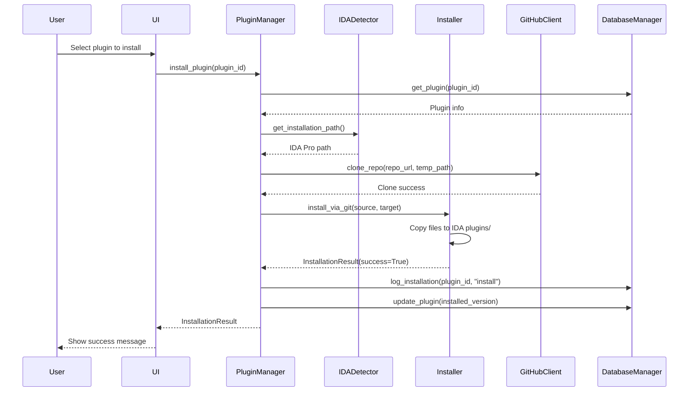
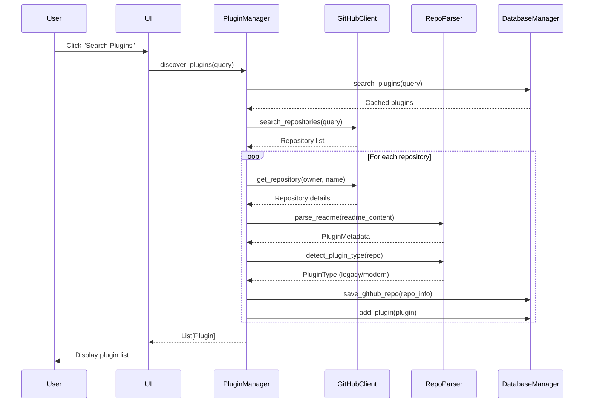

# C4 Model - IDA Pro Plugin Manager

## Table of Contents

1. [C4 Model Overview](#c4-model-overview)
2. [System Context](#system-context)
3. [Container View](#container-view)
4. [Component View](#component-view)
5. [Code View](#code-view)

---

## C4 Model Overview

The C4 model captures the static architecture of a software system using 4 levels of detail:

1. **System Context** - Big picture view showing the system and its relationships
2. **Containers** - Applications, data stores, microservices, etc.
3. **Components** - Internal structure of containers
4. **Code** - Class-level details (omitted for brevity)

---

## System Context

### Level 1: System Context



### System Context Description

**IDA Plugin Manager** sits between the user and the plugin ecosystem:

| Actor | Role | Interactions |
|-------|------|--------------|
| **Reverse Engineer** | Primary user | - Browse and search for plugins<br>- Install/update/uninstall plugins<br>- View installation history<br>- Configure IDA Pro paths |
| **Plugin Developer** | Content creator | - Host plugins on GitHub<br>- Tag releases<br>- Define plugin metadata |
| **GitHub** | External dependency | - REST API for queries<br>- Git protocol for cloning<br>- Release assets for downloads |
| **IDA Pro** | Target application | - Receives installed plugins<br>- Plugins extend IDA functionality |
| **Windows Filesystem** | Storage layer | - SQLite database storage<br>- Plugin installation directory<br>- Configuration files |

---

## Container View

### Level 2: Containers

```mermaid
C4Container
    title Container View - IDA Plugin Manager

    Person(analyst, "Reverse Engineer")

    Container(ui, "Desktop UI", "Dear PyGui", "User interface for plugin management")
    Container(core, "Core Engine", "Python", "Business logic orchestration")
    Container(github, "GitHub Client", "Python + requests", "GitHub API integration")
    Container(db, "Database", "SQLite", "Plugin metadata and history")

    Rel(analyst, ui, "Uses")
    Rel(ui, core, "Calls", "Plugin operations")
    Rel(core, github, "Queries", "Plugin discovery")
    Rel(core, db, "Reads/Writes", "Persistence")
    Rel(core, filesystem, "Accesses", "Plugin installation")
```

### Container Descriptions

| Container | Technology | Responsibilities | Interfaces |
|-----------|------------|------------------|------------|
| **Desktop UI** | Dear PyGui | - Render plugin browser<br>- Display status messages<br>- Handle user input<br>- Show installation progress | - Plugin selection<br>- Install/uninstall commands<br>- Settings dialogs |
| **Core Engine** | Python | - Plugin lifecycle management<br>- Installation coordination<br>- Compatibility validation<br>- Update checking | - `install_plugin()`<br>- `uninstall_plugin()`<br>- `check_updates()`<br>- `validate_compatibility()` |
| **GitHub Client** | requests + GitPython | - Search repositories<br>- Fetch metadata<br>- Clone repositories<br>- Download releases | - `search_repos()`<br>- `get_repo_info()`<br>- `clone_repo()`<br>- `download_release()` |
| **Database** | SQLite + SQLAlchemy | - Store plugin metadata<br>- Track installation history<br>- Cache GitHub data<br>- Persist settings | - CRUD operations<br>- Query interfaces<br>- Transaction management |

### Container Interaction Flows

**Plugin Installation Flow:**
```
UI → Core → GitHub Client → GitHub API
                ↓
           Database (log action)
                ↓
           Filesystem (copy files)
                ↓
           Database (update status)
                ↓
           UI (show result)
```

**Plugin Discovery Flow:**
```
UI → Core → GitHub Client → GitHub API
                ↓
           Repo Parser (extract metadata)
                ↓
           Database (cache results)
                ↓
           UI (display plugins)
```

---

## Component View

### Level 3: Components

```mermaid
C4Component
    title Component View - Core Engine

    Container(core, "Core Engine", "Business Logic") {
        Component(pm, "PluginManager", "Orchestrator", "Coordinates all plugin operations")
        Component(detector, "IDADetector", "Detector", "Finds IDA Pro installations")
        Component(installer, "PluginInstaller", "Installer", "Executes installation/uninstallation")
        Component(vm, "VersionManager", "Validator", "Version compatibility checking")
    }

    ContainerDb(db, "Plugin Database", "SQLite")

    Rel(pm, detector, "Uses", "Get IDA installation path")
    Rel(pm, installer, "Uses", "Install/uninstall plugins")
    Rel(pm, vm, "Uses", "Validate compatibility")
    Rel(pm, db, "Reads/Writes", "Persistence")
    ```

### Component Descriptions

#### Core Layer Components

| Component | Responsibilities | Key Methods |
|-----------|------------------|-------------|
| **PluginManager** | Central orchestrator | - `discover_plugins()`<br>- `install_plugin()`<br>- `uninstall_plugin()`<br>- `update_plugin()`<br>- `check_for_updates()` |
| **IDADetector** | IDA Pro discovery | - `detect_installations()`<br>- `get_version()`<br>- `get_plugin_directory()`<br>- `validate_installation()` |
| **PluginInstaller** | Installation execution | - `install_via_git()`<br>- `install_via_release()`<br>- `uninstall_plugin()`<br>- `backup_plugin()` |
| **VersionManager** | Version operations | - `parse_version()`<br>- `compare_versions()`<br>- `check_compatibility()`<br>- `is_update_available()` |

#### GitHub Layer Components

| Component | Responsibilities | Key Methods |
|-----------|------------------|-------------|
| **GitHubClient** | API communication | - `search_repositories()`<br>- `get_repository()`<br>- `get_releases()`<br>- `download_asset()`<br>- `clone_repository()` |
| **RepoParser** | Metadata extraction | - `parse_readme()`<br>- `parse_plugins_json()`<br>- `detect_plugin_type()`<br>- `extract_metadata()` |
| **ReleaseFetcher** | Release selection | - `get_latest_release()`<br>- `get_compatible_release()`<br>- `filter_by_compatibility()`<br>- `select_asset()` |

#### Database Layer Components

| Component | Responsibilities | Key Methods |
|-----------|------------------|-------------|
| **DatabaseManager** | Data persistence | - `add_plugin()`<br>- `get_plugin()`<br>- `update_plugin()`<br>- `search_plugins()`<br>- `log_installation()` |

---

## Code View

### Level 4: Code Structure

```
src/
├── main.py                      # Application entry point
├── models/                      # Pydantic data models
│   ├── plugin.py               # Plugin, ValidationResult, etc.
│   └── github_info.py          # GitHub models (Repo, Release, etc.)
├── config/                      # Configuration management
│   ├── constants.py            # App constants and paths
│   └── settings.py             # SettingsManager class
├── database/                    # Persistence layer
│   ├── models.py               # SQLAlchemy ORM models
│   ├── db_manager.py           # CRUD operations
│   └── migrations.py           # Database migrations
├── github/                      # GitHub integration
│   ├── client.py               # GitHub API client
│   ├── repo_parser.py          # Metadata parser
│   └── release_fetcher.py      # Release selection logic
├── core/                        # Business logic
│   ├── plugin_manager.py       # Main orchestrator
│   ├── ida_detector.py         # IDA Pro detection
│   ├── installer.py            # Installation execution
│   └── version_manager.py      # Version operations
├── ui/                          # User interface
│   ├── main_window.py          # Main application window
│   ├── plugin_browser.py       # Plugin list view
│   ├── status_panel.py         # Status messages
│   └── themes.py               # Color schemes
└── utils/                       # Utilities
    ├── logger.py               # Logging setup
    ├── file_ops.py             # File operations
    └── validators.py           # Validation helpers
```

### Key Class Relationships



---

## Package Dependencies

### Module Dependency Graph

```
┌─────────────────────────────────────────────────────────┐
│                      main.py                            │
└────────────────────┬────────────────────────────────────┘
                     │
                     ▼
┌─────────────────────────────────────────────────────────┐
│                   ui/main_window.py                     │
└────────────────────┬────────────────────────────────────┘
                     │
                     ▼
┌─────────────────────────────────────────────────────────┐
│              core/plugin_manager.py                     │
│  ┌──────────────┬──────────────┬──────────────┐        │
│  │              │              │              │        │
│  ▼              ▼              ▼              ▼        │
│ ida_detector  installer  version_manager  github/     │
│                                                 │        │
│                              ┌─────────────────┘        │
│                              ▼                          │
│                     database/db_manager               │
│                              │                          │
│                              ▼                          │
│                     models/ (Pydantic)                │
└─────────────────────────────────────────────────────────┘
```

### Dependency Rules

1. **UI** → **Core** ✅ Allowed
2. **Core** → **GitHub** ✅ Allowed
3. **Core** → **Database** ✅ Allowed
4. **Core** → **Models** ✅ Allowed
5. **Database** → **Models** ✅ Allowed
6. **GitHub** → **Models** ✅ Allowed
7. **UI** → **Database** ❌ Forbidden (must go through Core)
8. **GitHub** → **Database** ❌ Forbidden (must go through Core)

---

## Data Flow Diagrams

### Plugin Installation Flow



### Plugin Discovery Flow



---

## Related Documentation

- [Data Model](./02-data-model.md) - Detailed database schema
- [API Design](./03-api-design.md) - Internal API contracts
- [Deployment](./05-deployment.md) - Deployment architecture

---

## Document Metadata

- **Version**: 1.0.0
- **Last Updated**: 2026-01-02
- **Author**: IDA Plugin Manager Team
- **Related ADRs**: [001-layered-architecture](../adr/001-layered-architecture.md)
