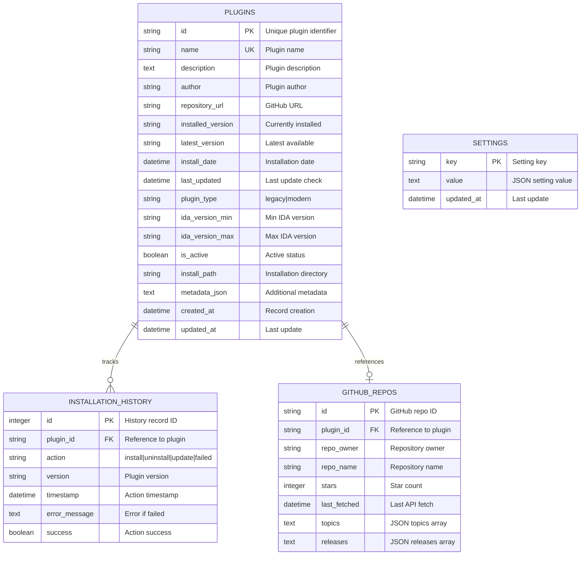

# Data Model - IDA Pro Plugin Manager

## Table of Contents

1. [Database Overview](#database-overview)
2. [Entity Relationship Diagram](#entity-relationship-diagram)
3. [Table Definitions](#table-definitions)
4. [Pydantic Models](#pydantic-models)
5. [Data Mapping](#data-mapping)
6. [Indexing Strategy](#indexing-strategy)
7. [Migration Strategy](#migration-strategy)

---

## Database Overview

### Technology Stack

- **Database**: SQLite 3.x
- **ORM**: SQLAlchemy 2.0+
- **Schema Location**: `%APPDATA%\IDA-Plugin-Manager\plugins.db`
- **Migration System**: Custom Python-based migration manager

### Design Principles

1. **Normalization**: 3NF to reduce redundancy
2. **JSON for Flexibility**: Use TEXT columns for JSON data
3. **Cascade Deletes**: Automatic cleanup of orphaned records
4. **Timestamps**: Track creation and update times
5. **Soft Deletes**: Keep history with `is_active` flag

---

## Entity Relationship Diagram



### Relationship Types

| Relationship | Type | Description |
|--------------|------|-------------|
| `PLUGINS → INSTALLATION_HISTORY` | One-to-Many | Plugin can have many history records |
| `PLUGINS → GITHUB_REPOS` | One-to-One | Plugin references one GitHub repo |
| `GITHUB_REPOS → PLUGINS` | Many-to-One | Repo can reference one plugin (nullable) |

---

## Table Definitions

### 1. plugins

Main table storing plugin metadata and installation status.

| Column | Type | Constraints | Description |
|--------|------|-------------|-------------|
| `id` | VARCHAR(255) | PRIMARY KEY | Unique plugin identifier (e.g., `github-user-repo`) |
| `name` | VARCHAR(255) | UNIQUE, NOT NULL, INDEX | Plugin display name |
| `description` | TEXT | NULLABLE | Plugin description |
| `author` | VARCHAR(255) | NULLABLE | Plugin author name |
| `repository_url` | VARCHAR(500) | NULLABLE | GitHub repository URL |
| `installed_version` | VARCHAR(50) | NULLABLE | Currently installed version |
| `latest_version` | VARCHAR(50) | NULLABLE | Latest available version |
| `install_date` | DATETIME | NULLABLE | When plugin was installed |
| `last_updated` | DATETIME | NULLABLE | When plugin was last updated |
| `plugin_type` | ENUM | NOT NULL | `legacy` or `modern` |
| `ida_version_min` | VARCHAR(20) | NULLABLE | Minimum IDA version required |
| `ida_version_max` | VARCHAR(20) | NULLABLE | Maximum IDA version supported |
| `is_active` | BOOLEAN | DEFAULT TRUE, INDEX | Whether plugin is active |
| `install_path` | VARCHAR(1000) | NULLABLE | Installation directory path |
| `metadata_json` | TEXT | NULLABLE | Additional metadata (JSON) |
| `created_at` | DATETIME | DEFAULT NOW() | Record creation time |
| `updated_at` | DATETIME | DEFAULT NOW(), ON UPDATE | Record update time |

**Indexes:**
- `idx_plugins_name` on `name`
- `idx_plugins_is_active` on `is_active`

### 2. github_repos

Caches GitHub repository information to reduce API calls.

| Column | Type | Constraints | Description |
|--------|------|-------------|-------------|
| `id` | VARCHAR(255) | PRIMARY KEY | GitHub repository ID (numeric ID as string) |
| `plugin_id` | VARCHAR(255) | FOREIGN KEY → plugins(id) | Reference to plugin |
| `repo_owner` | VARCHAR(255) | NOT NULL | Repository owner/organization |
| `repo_name` | VARCHAR(255) | NOT NULL | Repository name |
| `stars` | INTEGER | DEFAULT 0 | Star count |
| `last_fetched` | DATETIME | NULLABLE | Last API fetch timestamp |
| `topics` | TEXT | NULLABLE | Topics as JSON array |
| `releases` | TEXT | NULLABLE | Releases as JSON array |

**Foreign Key:**
- `fk_github_repos_plugin` → `plugins(id)` ON DELETE CASCADE

### 3. installation_history

Tracks all plugin installation operations.

| Column | Type | Constraints | Description |
|--------|------|-------------|-------------|
| `id` | INTEGER | PRIMARY KEY, AUTOINCREMENT | History record ID |
| `plugin_id` | VARCHAR(255) | FOREIGN KEY → plugins(id), NOT NULL | Reference to plugin |
| `action` | ENUM | NOT NULL | `install`, `uninstall`, `update`, `failed` |
| `version` | VARCHAR(50) | NULLABLE | Plugin version |
| `timestamp` | DATETIME | DEFAULT NOW(), INDEX | Action timestamp |
| `error_message` | TEXT | NULLABLE | Error details if failed |
| `success` | BOOLEAN | DEFAULT TRUE | Action success status |

**Indexes:**
- `idx_installation_history_timestamp` on `timestamp`

**Foreign Key:**
- `fk_installation_history_plugin` → `plugins(id)` ON DELETE CASCADE

### 4. settings

Application-wide settings storage.

| Column | Type | Constraints | Description |
|--------|------|-------------|-------------|
| `key` | VARCHAR(255) | PRIMARY KEY | Setting key |
| `value` | TEXT | NULLABLE | Setting value (JSON) |
| `updated_at` | DATETIME | DEFAULT NOW(), ON UPDATE | Last update time |

---

## Pydantic Models

### Plugin Models

Located in [`src/models/plugin.py`](../../src/models/plugin.py):

```python
class PluginType(str, Enum):
    LEGACY = "legacy"
    MODERN = "modern"

class Plugin(BaseModel):
    id: str
    name: str
    description: Optional[str]
    author: Optional[str]
    repository_url: Optional[str]
    installed_version: Optional[str]
    latest_version: Optional[str]
    install_date: Optional[datetime]
    last_updated: Optional[datetime]
    plugin_type: PluginType
    ida_version_min: Optional[str]
    ida_version_max: Optional[str]
    is_active: bool
    install_path: Optional[str]
    metadata: Dict

class ValidationResult(BaseModel):
    valid: bool
    plugin_type: Optional[PluginType]
    error: Optional[str]
    warnings: List[str]

class InstallationResult(BaseModel):
    success: bool
    plugin_id: str
    message: str
    error: Optional[str]
    previous_version: Optional[str]
    new_version: Optional[str]

class UpdateInfo(BaseModel):
    has_update: bool
    current_version: Optional[str]
    latest_version: Optional[str]
    changelog: Optional[str]
    release_url: Optional[str]
```

### GitHub Models

Located in [`src/models/github_info.py`](../../src/models/github_info.py):

```python
class GitHubRepo(BaseModel):
    id: int
    name: str
    full_name: str
    owner: str
    description: Optional[str]
    stars: int
    topics: List[str]
    language: Optional[str]
    clone_url: str
    html_url: str
    default_branch: str
    last_fetched: Optional[datetime]

class GitHubRelease(BaseModel):
    id: int
    tag_name: str
    name: Optional[str]
    body: Optional[str]
    published_at: Optional[datetime]
    prerelease: bool
    assets: List[GitHubAsset]
    html_url: str

class GitHubAsset(BaseModel):
    name: str
    size: int
    download_url: str
    content_type: str

class GitHubPluginInfo(BaseModel):
    repository: GitHubRepo
    releases: List[GitHubRelease]
    latest_release: Optional[GitHubRelease]
    readme_content: Optional[str]
    plugin_metadata: Optional[Dict]
    is_valid_plugin: bool
    detected_plugin_type: Optional[str]
```

---

## Data Mapping

### SQLAlchemy → Pydantic Conversion

Database models (SQLAlchemy) are converted to Pydantic models when moving between layers:

```python
def _db_to_model(db_plugin: Plugin) -> Plugin:
    """Convert SQLAlchemy model to Pydantic model."""
    return Plugin(
        id=db_plugin.id,
        name=db_plugin.name,
        description=db_plugin.description,
        author=db_plugin.author,
        repository_url=db_plugin.repository_url,
        installed_version=db_plugin.installed_version,
        latest_version=db_plugin.latest_version,
        install_date=db_plugin.install_date,
        last_updated=db_plugin.last_updated,
        plugin_type=PluginType(db_plugin.plugin_type),
        ida_version_min=db_plugin.ida_version_min,
        ida_version_max=db_plugin.ida_version_max,
        is_active=db_plugin.is_active,
        install_path=db_plugin.install_path,
        metadata=json.loads(db_plugin.metadata_json) if db_plugin.metadata_json else {},
    )
```

### JSON Serialization

Complex data stored as JSON in TEXT columns:

| Column | JSON Structure | Example |
|--------|----------------|---------|
| `metadata_json` | Dictionary | `{"custom_field": "value", "dependencies": ["dep1", "dep2"]}` |
| `topics` | Array of strings | `["ida-pro", "plugin", "analysis"]` |
| `releases` | Array of release objects | `[{"tag": "v1.0", "name": "Release 1.0"}]` |
| `settings.value` | Any JSON value | `{"theme": "Dark", "window_width": 1200}` |

---

## Indexing Strategy

### Primary Indexes

- All primary keys automatically indexed
- Foreign keys automatically indexed

### Secondary Indexes

| Table | Index | Columns | Purpose |
|-------|-------|---------|---------|
| `plugins` | `idx_plugins_name` | `name` | Fast name lookups |
| `plugins` | `idx_plugins_is_active` | `is_active` | Filter active plugins |
| `installation_history` | `idx_installation_history_timestamp` | `timestamp` | Time-based queries |

### Query Optimization

Common queries and their indexes:

```sql
-- Find installed plugins (uses is_active index)
SELECT * FROM plugins WHERE is_active = TRUE AND installed_version IS NOT NULL;

-- Search by name (uses name index)
SELECT * FROM plugins WHERE name LIKE '%analyzer%';

-- Get recent history (uses timestamp index)
SELECT * FROM installation_history ORDER BY timestamp DESC LIMIT 50;
```

---

## Migration Strategy

### Migration System

Located in [`src/database/migrations.py`](../../src/database/migrations.py):

```python
class Migration:
    def __init__(self, version: int, name: str, up_sql: str, down_sql: str):
        self.version = version
        self.name = name
        self.up_sql = up_sql      # SQL to apply migration
        self.down_sql = down_sql  # SQL to rollback migration

class MigrationManager:
    def migrate(self, target_version: Optional[int] = None) -> bool
    def get_current_version(self) -> int
    def get_applied_migrations(self) -> List[int]
```

### Version Tracking

Migration versions stored in `schema_migrations` table:

```sql
CREATE TABLE schema_migrations (
    version INTEGER PRIMARY KEY,
    name TEXT NOT NULL,
    applied_at TIMESTAMP DEFAULT CURRENT_TIMESTAMP
);
```

### Example Migration

```python
Migration(
    version=2,
    name="Add plugin ratings",
    up_sql="""
        ALTER TABLE plugins ADD COLUMN rating INTEGER DEFAULT 0;
        ALTER TABLE plugins ADD COLUMN downloads INTEGER DEFAULT 0;
        CREATE INDEX idx_plugins_rating ON plugins(rating);
    """,
    down_sql="""
        DROP INDEX idx_plugins_rating;
        ALTER TABLE plugins DROP COLUMN downloads;
        ALTER TABLE plugins DROP COLUMN rating;
    """
)
```

---

## Data Lifecycle

### Plugin Lifecycle States

```
┌─────────────┐
│ Discovered  │  ← Found on GitHub, not in database
└──────┬──────┘
       │ add_plugin()
       ▼
┌─────────────┐
│   Cataloged │  ← In database, not installed
└──────┬──────┘
       │ install_plugin()
       ▼
┌─────────────┐
│  Installed  │  ← Files copied, version tracked
└──────┬──────┘
       │ check_for_updates()
       ▼
┌─────────────┐
│  Outdated   │  ← New version available
└──────┬──────┘
       │ update_plugin()
       ▼
┌─────────────┐
│    Updated  │  ← Running latest version
└──────┬──────┘
       │ uninstall_plugin()
       ▼
┌─────────────┐
│  Uninstalled│  ← Files removed, history kept
└─────────────┘
```

### Data Retention

| Data Type | Retention Policy | Cleanup Method |
|-----------|------------------|----------------|
| Plugin records | Permanent | Manual deletion |
| Installation history | Configurable (default: 1000 entries) | FIFO deletion |
| GitHub cache | 24 hours TTL | Refresh on access |
| Settings | Permanent | Manual reset |

---

## Related Documentation

- [C4 Model](./01-c4-model.md) - System architecture overview
- [API Design](./03-api-design.md) - Database API contracts
- [DatabaseManager Source](../../src/database/db_manager.py) - Implementation

---

## Document Metadata

- **Version**: 1.0.0
- **Last Updated**: 2026-01-02
- **Schema Version**: 1
- **Author**: IDA Plugin Manager Team
